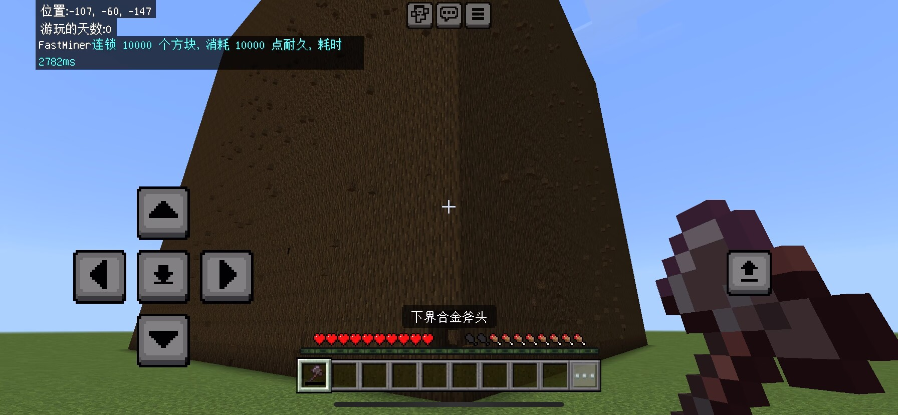

# FastMiner

一个基于 Levilamina 的快速连锁采集 Mod，支持 Server 和 Client 双端运行。

## 🚀 性能测试

> 测试环境均为: Windows 10 22H2 + 同时运行客户端和服务端  
> 配置: i5-6300HQ@2.9Ghz + DDR4 8G 2133Mhz

| 数量 | 耗时    | 平均         |
| ---- | ------- | ------------ |
| 5    | 0ms     | /            |
| 33   | 3ms     | /            |
| 67   | 8ms     | /            |
| 1k   | 117ms   | 0.117ms/个   |
| 1w   | 1261ms  | 0.1261ms/个  |
| 10w  | 13592ms | 0.13592ms/个 |

> 🧩 2025.11.7 更新：重构后的调度系统性能测试 **100096** 个方块, 总耗时 **10606ms**, 平均 **0.10595ms/个**, 理论提升 22%🚀。

## 客户端侧模组安装 (Client Side)

此版本适用于本地游玩使用，无虚复杂配置，开箱即用，为原版生存添加便利

> 注意：此版本无法在多人联机中使用(您必须为局域网主机或进入本地世界)

```bash
lip install github.com/engsr6982/FastMiner#client
```

> Tip: 按住 V 键挖掘方块即可连锁(默认绑定 V 键，可在配置文件更改)

### 命令

- /fm 打开方块配置GUI - 配置覆盖方块

### 配置文件

```json
{
  "version": 3,
  "dispatcher": {
    "globalBlockLimitPerTick": 256, // 全局每刻连锁上线
    "maxResumeTasksPerTick": 16 // 每刻恢复任务上限
  },
  "bindKey": 86, // 绑定按键 (Windows VK Code)

  // 全局默认配置，当按下快捷键进行破坏时，如果没有找到覆盖配置
  // 将会使用此默认配置进行进行连锁任务
  "blockDefault": {
    "name": "全局默认配置",
    // "limit": 256, // 最大连锁采集数量 (可选, 默认 1024)
    "destroyMode": "Default", // 破坏模式，支持: Default 和 Cube。 Default搜索相邻的6个面，Cube 3x3x3搜索
    "similarBlock": [] // 不用填
  },

  // 方块覆盖配置
  // 你可以在这里调整特定方块的行为，做到针对性覆盖默认配置
  // 比如: 金合欢树长的歪七扭八，默认配置的相邻搜索默认容易遗漏方块，您就可以在这里重写为 3x3x3 Cube 搜索模式
  "overrides": {
    // 方块配置，Key 填写方块命名空间
    "minecraft:spruce_log": {
      "name": "云杉木原木", // 方块名称
      "destroyMode": "Default", // 破坏模式，支持: Default 和 Cube。 Default搜索相邻的6个面，Cube 3x3x3搜索
      "similarBlock": [] // 相似方块，填写方块命名空间，连锁时会一起采集
    },
    "minecraft:birch_log": {
      "name": "白桦木原木",
      "limit": 200, // 最大连锁采集数量(可选字段)
      "destroyMode": "Default",
      "similarBlock": []
    }
  }
}
```

## 服务端侧插件安装 (Server Side)

此版本适用于 BDS 服务器使用，为整个服务器的玩家提供连锁采集功能，并支持更多约束配置

> 此版本无法在客户端侧加载，客户端请使用客户端侧模组
>
> 当客户端同样安装了客户端侧模组时，服务端侧的命令会覆盖客户端侧的命令

```bash
lip install github.com/engsr6982/FastMiner
```

> Tip：初次使用，需输入命令 /fm 打开 GUI，开启需要连锁的方块。

### 命令

- /fm 打开设置 GUI
- /fm off 关闭连锁采集
- /fm on 开启连锁采集
- /fm manager 方块管理 GUI（OP） 配置方块白名单和经济等

### 配置文件

```json
{
  "version": 6,
  "dispatcher": {
    "globalBlockLimitPerTick": 256, // 每次调度最多采集多少个方块
    "maxResumeTasksPerTick": 16 // 每次调度最多恢复多少个任务
  },
  "moneys": {
    "Enable": false, // 是否启用经济系统
    "MoneyType": "LLMoney", // 经济类型 LLMoney 或 ScoreBoard
    "MoneyName": "money", // 经济名称
    "ScoreName": "" // 计分板名称
  },
  "blocks": {
    // 方块配置，键(Key) 填写方块命名空间
    "minecraft:acacia_log": {
      "name": "金合欢木原木", // 方块名称
      "cost": 0, // 每个方块消耗的经济
      "limit": 256, // 最大连锁采集数量
      "destroyMod": "Cube", // 破坏模式，支持: Default 和 Cube。 Default搜索相邻的6个面，Cube 3x3x3搜索
      "silkTouschMod": "Unlimited", // 精准采集附魔，Unlimited 无限制、Forbid 禁止精准附魔、Need 需要精准附魔
      "tools": [
        "minecraft:wooden_axe", // 工具限制，如果留空数组，则代表不限制工具类型
        "minecraft:stone_axe",
        "minecraft:iron_axe",
        "minecraft:diamond_axe",
        "minecraft:golden_axe",
        "minecraft:netherite_axe"
      ],
      "similarBlock": [] // 相似方块，填写方块命名空间，连锁时会一起采集
    }
  }
}
```


